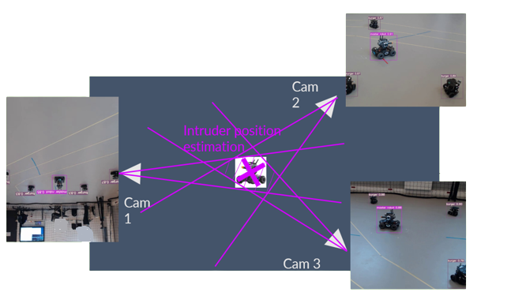

# Estimation of the position of the target

## Our setup

Multiple cameras are are disposed around the arena.

  

They are providing their video stream to their raspberry. The raspberry, with PyTorch and our neural network trained earlier, can recognize the different robots in each picture.

We have then the position of the box for the different agents in our arena.

## How to retrieve the coordinates of the intruder

### Within each camera

Let's have a look at the following example, for one of the camera.

We know the position of the different boxes for each image (and for each camera).

  

We can then obtain θ_1 and θ_2.

We do know the exact position of each camera in the space (position and orientation), so we are able to know the real direction of our cone of vision.

### Cross-reference the data for the final position

The previous calculation being made for each camera (in real time), we can then cross-reference the different cones of vision in order to know the real position of the intruder.

  

